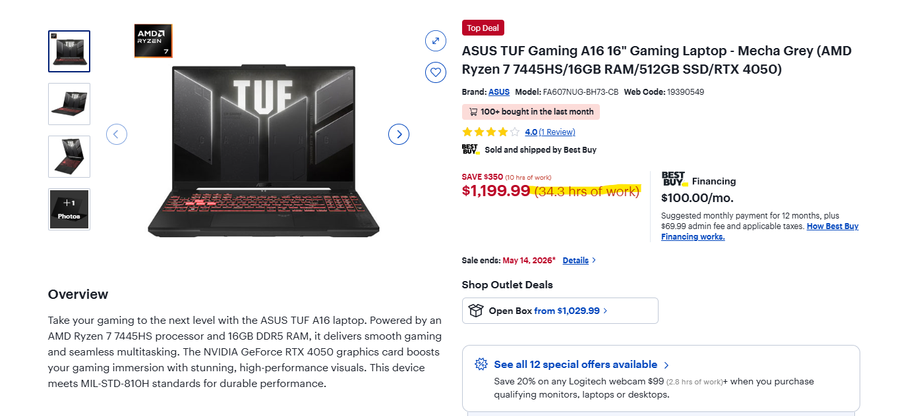
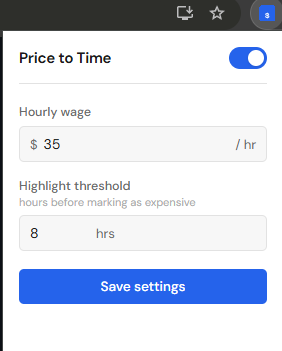
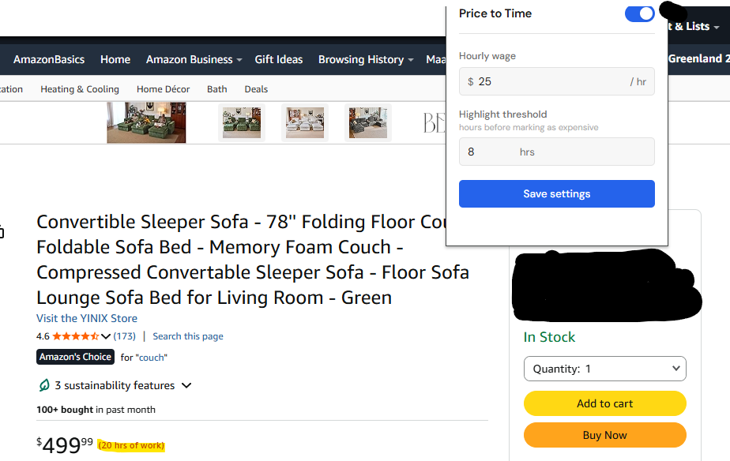

# Price to Time

A Chrome extension that converts prices on any webpage into the equivalent amount of time you'd need to work to afford them, based on a customizable hourly wage.

---

## Overview

Every price tag on the internet is an abstraction. Seeing "$120" doesn't mean much on its own until you frame it in terms of real effort. At $20/hr, that's 6 hours of work. This extension makes that trade-off visible as you browse.

No sign-up, no external API, no data collection. Everything runs locally in the browser.

---

## Features

- Detects and converts prices inline on any webpage
- Supports USD, EUR, GBP, and CAD formats
- Handles both static and dynamically loaded content (React, infinite scroll, etc.)
- Works on split-DOM prices where the currency symbol and digits are in separate elements
- Skips thumbnail picker cards (e.g. Amazon variant selectors, eBay image tiles)
- Configurable hourly wage and expensive item threshold
- Highlights items that exceed a set work-hour threshold
- Enable/disable toggle without losing settings

---

## How It Works

**Price detection** uses a regular expression to scan text nodes in the DOM for recognizable price patterns. The scanner walks the document tree using `TreeWalker` to avoid scripts, style tags, editable fields, and visually hidden elements.

**Split-DOM handling** — some sites (notably Amazon) render a price like `$43.49` by splitting `$`, `43`, `.`, and `49` into separate inline elements. No individual text node contains a full price. A second pass queries `[class*="price"]` elements, assembles their `textContent`, and injects a label after the element if no child text node already matched.

**Thumbnail card filtering** — the extension checks if a price is inside a container that is both narrow (under 140px) and contains an image. That combination identifies thumbnail picker cards and skips them, avoiding clutter on variant selectors without affecting normal product pages.

**Injection** replaces the original text node with a document fragment preserving the price text and appending a styled label. A `data-ptt-injected` attribute prevents double-injection.

**Dynamic content** is handled by a `MutationObserver` that processes only newly added subtrees.

**Settings** use `chrome.storage.sync` for persistence across sessions and devices.

---

## Demo

### Price conversion on a product page
[Insert screenshot of product page with converted prices here]


### Extension popup UI
[Insert screenshot of extension popup UI here]


### Expensive item highlight
[Insert screenshot showing highlighted expensive item here]


---

## Installation

1. Clone this repository:
   ```
   git clone https://github.com/yourusername/price-to-time-extension.git
   ```
2. Open Chrome and go to `chrome://extensions`
3. Enable **Developer mode** (toggle in top-right corner)
4. Click **Load unpacked** and select the root directory of the cloned repo
5. Click the extension icon in the toolbar to configure your hourly wage

---

## Usage

The extension runs automatically on every page. Prices appear with a small gray annotation showing equivalent work time. Red text indicates items above your set threshold.

To configure: click the icon, enter your hourly wage, adjust the highlight threshold, and save. Changes apply immediately.

---

## Design Decisions

**No framework.** The popup is plain HTML, CSS, and JavaScript. No build step needed.

**TreeWalker over querySelectorAll.** Price content lives in text nodes. `TreeWalker` with `NodeFilter.SHOW_TEXT` traverses only text nodes, which is more appropriate and avoids touching every element.

**Fragment-based replacement.** Injecting via `replaceChild` with a document fragment preserves the surrounding DOM and avoids layout shifts.

**Thumbnail card detection.** The narrow-container check requires both small width AND an `` ancestor. Width alone is too blunt and blocks legitimate prices on sites like BestBuy whose price elements happen to sit in narrower containers.

**`chrome.storage.sync`.** Persists settings across devices tied to the same Google account.

---

## Development Timeline

**Day 1** — Set up project structure and manifest, implemented price parsing and time conversion

**Day 2** — Built DOM injection system, added guards against editable fields and duplicates

**Day 3** — Added MutationObserver, built popup UI and storage integration

**Day 4** — Wired content script to storage, fixed thumbnail injection issue, added split-DOM price support for Amazon

**Day 5** — Cleaned up utilities, wrote README

---

## Future Improvements

- Currency conversion with cached exchange rates
- Per-domain blocklist for sites where annotations are unwanted
- After-tax wage estimator in the popup
- Keyboard shortcut to toggle without opening popup
- Firefox support (minimal manifest changes needed)
